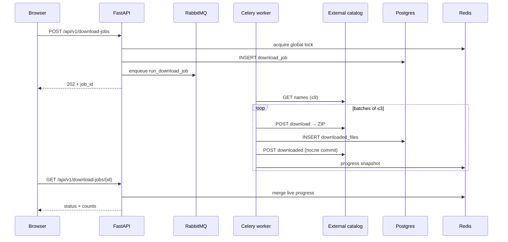

# Download Web Service

Сервис скачивания каталога текстовых файлов через внешнее API и расчёта статистики по цифрам.

## Стек

Python 3.12 · FastAPI · SQLAlchemy · Celery · PostgreSQL · Redis · RabbitMQ · React · Nginx · Docker

## One-command demo

```powershell
Copy-Item .env.example .env
# Отредактируйте EXTERNAL_API_BASE_URL и X_CANDIDATE_ID
.\scripts\up.ps1
```

| URL | Что |
|-----|-----|
| http://localhost:8080 | UI |
| http://localhost:8080/docs | Swagger |
| http://localhost:8080/ready | Postgres + Redis + RabbitMQ |
| http://localhost:15672 | RabbitMQ UI (`dws` / `dws_secret`) |

Остановка: `.\scripts\down.ps1`

Полезные `make`-цели: `up`, `down`, `logs`, `migrate`, `lint`, `test`, `build`.

## Проверки качества / CI

Локально:

```powershell
.\scripts\check-backend.ps1   # ruff + pytest + coverage (>=70%)

cd frontend
npm ci
npm run build
```

CI: `.github/workflows/ci.yml` — backend (ruff/pytest/coverage) и frontend (build) на push/PR.

## Архитектура

Слои (Clean Architecture):

| Слой | Ответственность |
|------|-----------------|
| `domain` | сущности, правила имён файлов, доменные ошибки |
| `application` | use cases, DTO, порты |
| `infrastructure` | Postgres, Redis, Celery, HTTP-клиент каталога, файлы |
| `presentation` | FastAPI routers / middleware |
| `workers` | Celery tasks |

```
Browser → Nginx (frontend) → FastAPI (api)
                              ↘ Celery worker ← RabbitMQ
                              ↘ PostgreSQL / Redis / files volume
```

### Поток скачивания



### Логи

API и worker пишут **JSON-логи** в stdout (`LOG_FORMAT=json`). В записи попадают `timestamp`, `level`, `logger`, `message`, а также `request_id` (HTTP, заголовок `X-Request-ID`) и `job_id` (download job). Для локальной читаемости: `LOG_FORMAT=text`.

Graceful shutdown: uvicorn `--timeout-graceful-shutdown 30`, Celery `worker_soft_shutdown_timeout=30`.

## API

| Method | Path | Назначение |
|--------|------|------------|
| POST | `/api/v1/download-jobs` | Старт скачивания |
| GET | `/api/v1/download-jobs/{id}` | Статус/прогресс |
| GET | `/api/v1/files` | Список файлов |
| POST | `/api/v1/files/select-all-ids` | Все id |
| POST | `/api/v1/calculations` | Статистика цифр |

